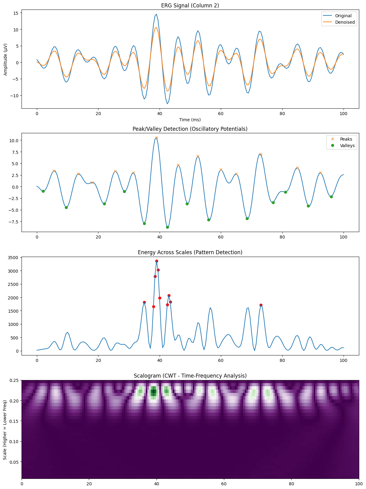
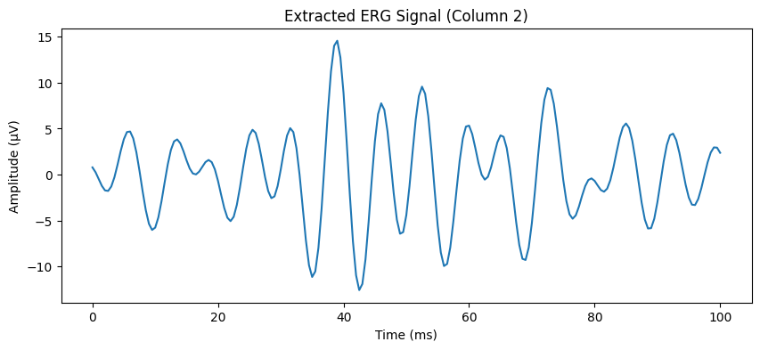
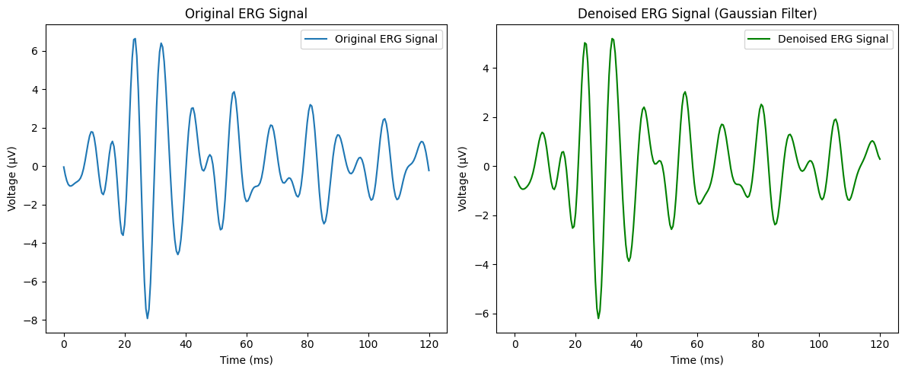

# Advanced ERG Signal Analysis: Denoising & Wavelet-Based Feature Extraction

## 🔬 Project Overview
This repository contains a specialized pipeline for the analysis of **Electroretinogram (ERG)** signals, specifically focused on the isolation and quantification of **Oscillatory Potentials (OPs)**. 

Using high-order signal processing techniques, this project automates the transition from raw, noisy clinical data to high-fidelity time-frequency scalograms. This is critical for identifying early-stage biomarkers in retinal pathologies.

### Key Technical Contributions:
*   **Automated Data Extraction:** Robust parsing of clinical Excel datasets (`.xlsx`) with automated header detection and NaN handling.
*   **Precision Denoising:** Implementation of a **1D Gaussian Filter** to suppress high-frequency artifacts while maintaining the physiological integrity of the a-wave and b-wave complexes.
*   **Morphological Feature Detection:** Peak and valley identification tuned for the specific frequency response of Oscillatory Potentials.
*   **Time-Frequency Analysis (CWT):** Utilization of the **Continuous Wavelet Transform (CWT)** with the **Mexican Hat (Ricker) wavelet** to visualize energy distribution across multiple scales.

---

## 📊 Comprehensive Analysis Results

The primary output of the pipeline provides a multi-stage view of the signal's transformation:

*Figure 1: Comprehensive dashboard showing (Top to Bottom) Denoising, Peak Detection, Energy Thresholding, and CWT Scalogram Analysis.*

---

## 🛠 Methodology

### 1. Data Extraction & Preprocessing
The script identifies the relevant signal columns and time-stamps from raw clinical exports, ensuring the data is normalized for analysis.

*Figure 2: Extracted raw ERG time-series from clinical data.*

### 2. Gaussian Denoising
To ensure the high-frequency "ripples" (OPs) are not lost to noise, we apply a Gaussian filter. This preserves the underlying morphology much better than standard moving-average filters.

*Figure 3: Side-by-side comparison of the original noisy signal vs. the denoised result.*

### 3. Wavelet Scalogram (Time-Frequency)
Traditional Fourier Transforms lose time-localization. By using **CWT**, we can pinpoint exactly *when* specific frequency bursts occur (typically between 20ms and 60ms in healthy ERGs). The green regions in the scalogram represent the highest energy concentrations of the Oscillatory Potentials.

---

## 🚀 Getting Started

### Prerequisites
* Python 3.9+
* Libraries: `numpy`, `pandas`, `scipy`, `matplotlib`, `pywavelets`, `openpyxl`

### Installation
1. Clone the repository:
   bash
   git clone https://github.com/raianeyahiaoui/ERG-Wavelet-Analysis.git
   cd ERG-Wavelet-Analysis

## Execution
   * Run the main Proof-of-Concept (PoC) script
     python erg_wavelet_poc_borisov.py

## 📁 Repository Structure
* erg_wavelet_poc_borisov.py: Main analysis script containing the CWT logic and plotting functions.
* 01 Appendix 1.xlsx: Sample ERG dataset used for the PoC.
* requirements.txt: List of necessary Python packages.
* erg-*.png: Visualizations of the analysis results

## 👨‍🔬 About the Author
* Yahiaoui Raiane
* Telecommunication Systems Engineer | AI Researcher
* 📧 Email: yahiaoui.raiane7@gmail.com
  
* This project is licensed under the MIT License – see the LICENSE file for details.
